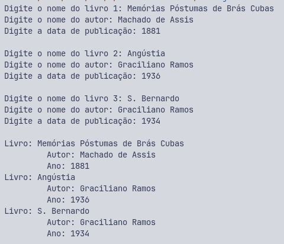

# Exercícios C

Esse repositório foi criado para armazenar os exercícios da matéria Programação Estruturada, da faculdade! Os exercícios foram feitos usando a linguagem de programação C.

#### Ex001 > O programa imprime o valor ASCII de um caractere digitado pelo usuário.
#### Ex002 > Programa para calcular a soma, diferença, produto e quociente de dois números digitados pelo usuário.

### Vetores-Matrizes 
#### Ex001

O programa recebe três livros e cadastra em um sistema de biblioteca. Os dados a serem digitados são, respectivamente: Nome do livro, nome do autor e ano publicado! 

